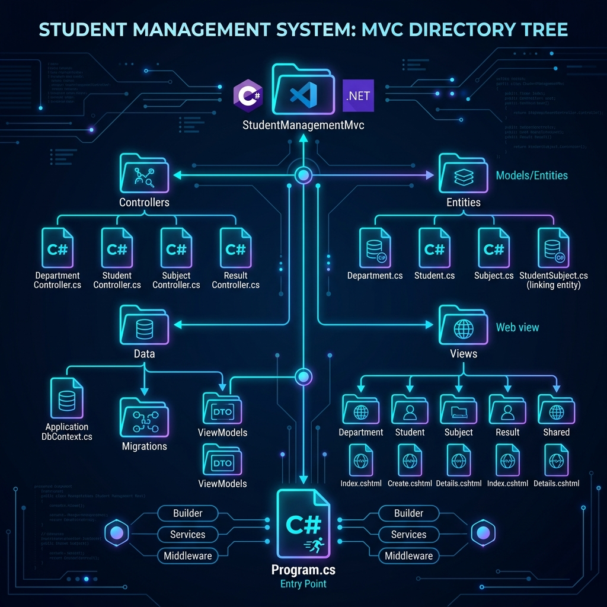
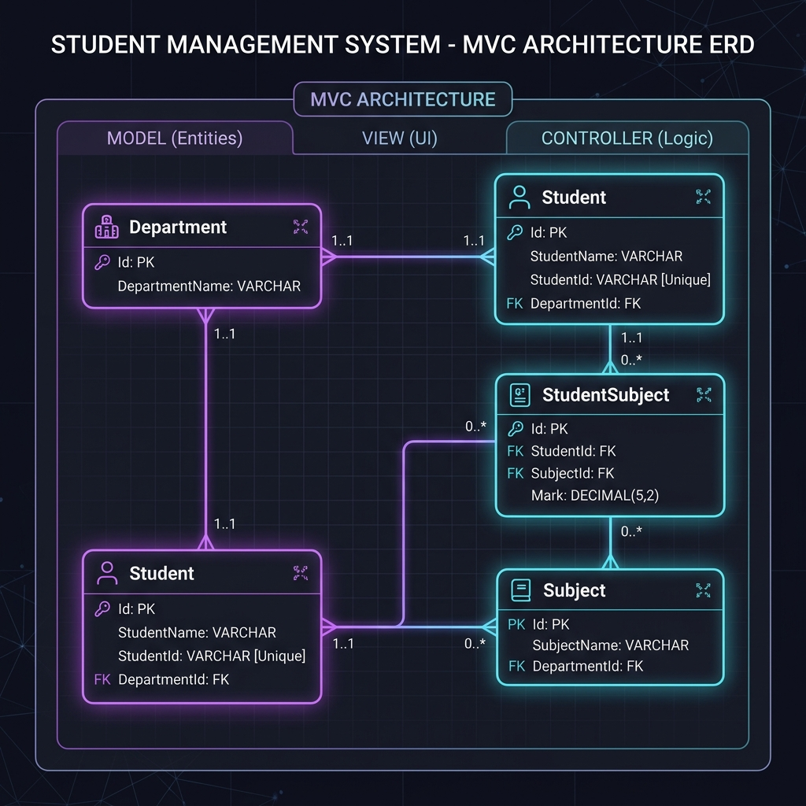
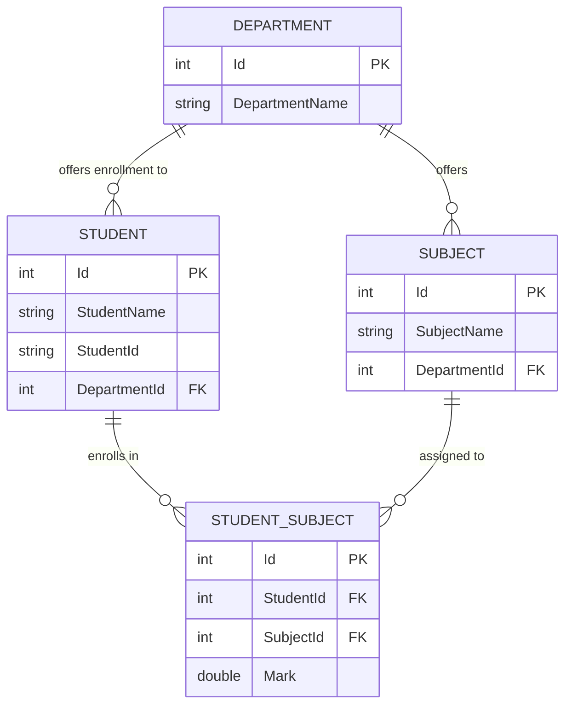

# 🎓 Student Management System (ASP.NET Core MVC)

A modern, robust, and scalable web application built with **ASP.NET Core MVC (.NET 9)**, **Entity Framework Core**, and **SQL Server**. This application provides a comprehensive solution for managing departments, students, course subjects, marks entry, and academic performance results with automated average calculations.

---

## 🖼️ Architecture & Project Directory Tree Graphic

Below is the visual overview of the project structure, component breakdown, and directory organization:



---

## 🗂️ Project Directory Structure

```text
StudentManagementMvc/
│
├── 📁 StudentManagementMvc/            # Main Web Application Source Directory
│   ├── 📁 Controllers/                # Controller layer handling HTTP requests & business logic
│   │   ├── DepartmentController.cs    # CRUD actions for Departments
│   │   ├── HomeController.cs          # Landing page & dashboard navigation
│   │   ├── ResultController.cs        # Mark assignments, results computation & statistics
│   │   ├── StudentController.cs       # Student profile & department assignment management
│   │   └── SubjectController.cs       # Course & subject offering management
│   │
│   ├── 📁 Entities/                   # EF Core Domain Database Entities
│   │   ├── Department.cs              # Department entity definition
│   │   ├── Student.cs                 # Student entity definition
│   │   ├── Subject.cs                 # Subject entity definition
│   │   └── StudentSubject.cs          # Many-to-Many junction entity with Mark property
│   │
│   ├── 📁 Data/                       # Data Access Layer & ORM Configuration
│   │   ├── ApplicationDbContext.cs    # EF Core DbContext & Fluent API relationship mappings
│   │   └── 📁 Migrations/             # EF Core database migrations log & snapshot
│   │
│   ├── 📁 Models/                     # ViewModels (Data Transfer Objects for Razor Views)
│   │   ├── DepartmentVm.cs            # ViewModel for department forms
│   │   ├── ErrorViewModel.cs          # Standard error display model
│   │   ├── StatisticsVm.cs            # System dashboard summary stats DTO
│   │   ├── StudentMarkVm.cs           # Student grade entry ViewModel
│   │   ├── StudentResultVm.cs         # Student scorecard presentation model
│   │   ├── StudentSubjectVm.cs        # Subject-mark association ViewModel
│   │   ├── StudentVm.cs               # Student registration & edit ViewModel
│   │   └── SubjectVm.cs               # Subject registration ViewModel
│   │
│   ├── 📁 Views/                      # Razor UI Presentation Layer (.cshtml)
│   │   ├── 📁 Department/             # Department Razor views (Index, Create, Edit, Details)
│   │   ├── 📁 Home/                   # General home page & privacy views
│   │   ├── 📁 Result/                 # Marks input, student result sheet & report views
│   │   ├── 📁 Shared/                 # Global site layout template (_Layout.cshtml, _ValidationScriptsPartial)
│   │   ├── 📁 Student/                # Student management views
│   │   └── 📁 Subject/                # Course subject views
│   │
│   ├── 📁 Properties/                 # Launch profiles & environment settings (launchSettings.json)
│   ├── 📁 wwwroot/                    # Static web assets (Bootstrap, custom CSS, JS, icons)
│   │
│   ├── appsettings.json               # Primary configuration & Database connection strings
│   ├── appsettings.Development.json   # Development environment configuration overrides
│   ├── Program.cs                     # App entry point, dependency injection & HTTP middleware pipeline
│   └── StudentManagementMvc.csproj    # .NET 9 Project file & package dependencies
│
├── 📁 assets/                         # Documentation graphics & architecture diagrams
│   ├── project_tree_diagram.png       # Visual directory tree graphic
│   └── database_erd_diagram.png       # Visual database ERD architecture diagram
│
├── StudentManagementMvc.slnx          # Visual Studio solution file
├── README.md                          # Project documentation (this file)
└── .readme                            # Shortcut copy of documentation
```

---

## 📊 Database Entity Relationship Diagram (ERD)

The application utilizes a relational database structure designed around EF Core Code-First paradigms:



### Entity Breakdown & Relationships



- **Department (1) ── (N) Student**: A department can host multiple enrolled students.
- **Department (1) ── (N) Subject**: A department offers multiple subjects.
- **Student (N) ── (M) Subject**: Linked through the **StudentSubject** junction table, allowing custom mark entries (`Mark`) for each student-subject pair.

---

## ✨ Key Features & Functionalities

1. **Department Management (`/Department`)**
   - Create, list, edit, and delete academic departments.

2. **Student Directory (`/Student`)**
   - Manage student profiles, including unique Student IDs and department assignments.

3. **Subject Catalog (`/Subject`)**
   - Define course offerings categorized by academic departments.

4. **Result & Grade Management (`/Result`)**
   - **Assign Subjects**: Dynamically enroll students into department subjects.
   - **Mark Entry**: Input numerical marks for individual student subjects.
   - **Automated Scorecard**: Real-time calculation of overall averages and grade summaries.
   - **Analytics & Statistics**: Overview of overall student performance metrics.

5. **Security & Identity**
   - Built-in ASP.NET Core Identity authentication system with EF Core database integration.

---

## 🚀 Getting Started

### Prerequisites
- [.NET 9.0 SDK](https://dotnet.microsoft.com/download/dotnet/9.0)
- [SQL Server](https://www.microsoft.com/en-us/sql-server/) (or LocalDB / Express Edition)
- Visual Studio 2022 / VS Code

### Installation & Run Steps

1. **Clone or Navigate to Project Root**:
   ```bash
   cd "c:\Farhan\c sharp\StudentManagementMvc"
   ```

2. **Configure Database Connection String**:
   Open `StudentManagementMvc/appsettings.json` and ensure `DefaultConnection` points to your local SQL Server instance:
   ```json
   "ConnectionStrings": {
     "DefaultConnection": "Server=(localdb)\\mssqllocaldb;Database=StudentManagementMvcDb;Trusted_Connection=True;MultipleActiveResultSets=true"
   }
   ```

3. **Apply Database Migrations**:
   Run EF Core migration command to generate the database schema:
   ```bash
   dotnet ef database update --project StudentManagementMvc
   ```

4. **Run the Application**:
   ```bash
   dotnet run --project StudentManagementMvc
   ```

5. **Access in Browser**:
   Open your browser and navigate to `https://localhost:7198` (or the port specified in terminal output).

---

## 🛠️ Technology Stack

- **Framework**: ASP.NET Core 9.0 (MVC pattern)
- **Language**: C# 13 / .NET 9
- **ORM / Database**: Entity Framework Core 9.0 + SQL Server
- **UI & Layout**: Razor Views (`.cshtml`), Bootstrap 5, FontAwesome
- **Identity**: Microsoft.AspNetCore.Identity.EntityFrameworkCore
